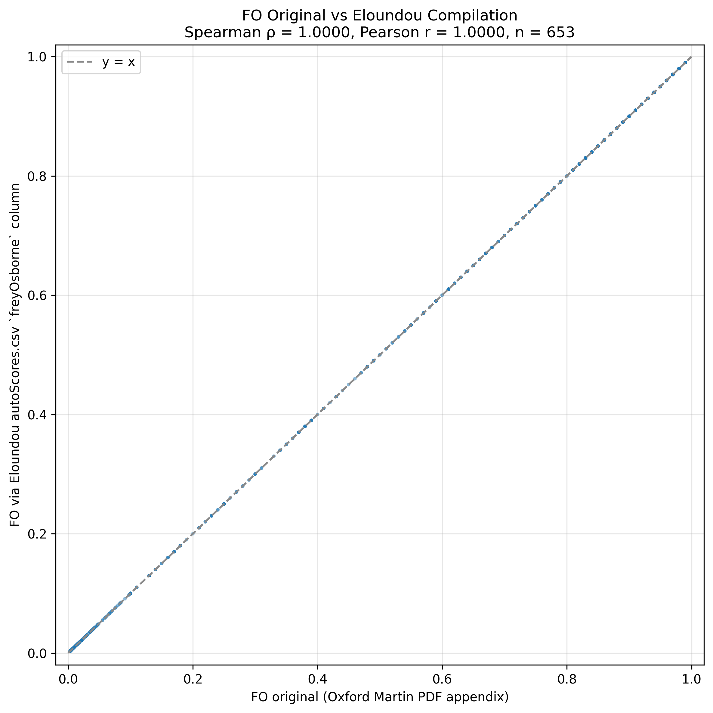
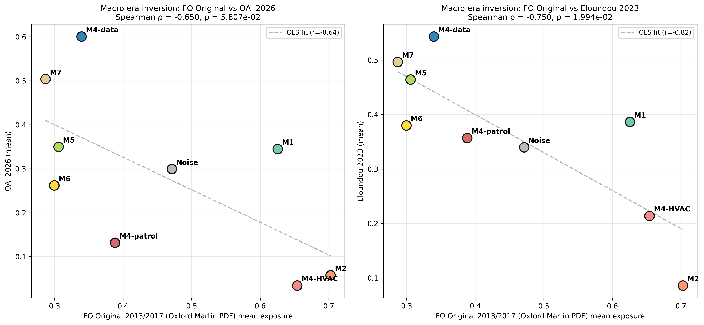

# Frey-Osborne Data Hardening

Goal: replace the second-hand Frey-Osborne 2013 probabilities (originally taken from Eloundou et al.'s `autoScores.csv`) with the original 702-row appendix table from the Oxford Martin School working paper, then verify the era-inversion finding still holds.

## Step 1: Original FO data — successfully obtained

- Source: Oxford Martin School official working paper PDF (https://oms-www.files.svdcdn.com/production/downloads/academic/future-of-employment.pdf)
- File: `frey_osborne_working_paper.pdf` (1.3 MB)
- Appendix pages: 62–78 (PDF pages); printed pages 61–77.
- Parsed: **702/702 rows**, 70/70 training-label rows, 702 unique SOC codes, probability range 0.0028–0.99.
- Output: `frey_osborne_original_702.csv` (rank, probability, training_label, soc_code, occupation).

## Step 2: Consistency check — FO_original vs FO_Eloundou-compiled

- SOC overlap: **653 occupations** matched on 6-digit SOC.
- **Spearman ρ = 1.0000** (p = 0.00e+00)
- **Pearson r = 1.0000** (p = 0.00e+00)
- Mean |Δ| = 0.0000, max |Δ| = 0.0000
- Exact match (|Δ|<0.001): 653/653 = 100.0%
- Close (|Δ|<0.01): 653/653 = 100.0%
- Within 0.05: 653/653 = 100.0%

✓ **Consistency verdict: HIGH.** The Eloundou-compiled column is essentially identical to the original FO appendix. Both versions produce equivalent macro-level inferences. We default to the **original** for the paper because the provenance is cleaner.

## Step 3: Era inversion re-run with FO_original

Macro-level mean exposures (FO old = Eloundou-compiled; FO orig = parsed appendix):

| Macro | n_DWAs | mean OAI | mean Eloundou | mean AIOE | mean FO_old | mean FO_orig |
|---|---|---|---|---|---|---|
| **M2** | 168 | 0.0577 | 0.0861 | -0.7874 | 0.7011 | 0.7028 |
| **M4-HVAC** | 84 | 0.0345 | 0.2141 | -0.6011 | 0.6449 | 0.6541 |
| **M4-patrol** | 85 | 0.1318 | 0.3571 | 0.1121 | 0.3743 | 0.3883 |
| **M1** | 140 | 0.345 | 0.3865 | -0.1923 | 0.622 | 0.6256 |
| **M6** | 402 | 0.2622 | 0.3801 | 0.3567 | 0.2793 | 0.2996 |
| **Noise** | 766 | 0.2995 | 0.3401 | -0.0078 | 0.4693 | 0.4713 |
| **M5** | 68 | 0.35 | 0.4643 | 0.5739 | 0.2895 | 0.3058 |
| **M4-data** | 145 | 0.6007 | 0.5434 | 0.8905 | 0.3367 | 0.3395 |
| **M7** | 103 | 0.5039 | 0.4966 | 0.4689 | 0.2862 | 0.2869 |

**Macro-level FO_old vs FO_orig Spearman: ρ = 0.9833, p = 1.936e-06** (within-pair check that the two FO versions yield essentially the same macro ordering).

### Era inversion: FO_original vs LLM-era indicators (macro-level)

| Pair | ρ (old) | p (old) | ρ (orig) | p (orig) |
|---|---|---|---|---|
| FO ↔ OAI (n=9 macros)      | -0.5833 | 9.919e-02 | **-0.6500** | **5.807e-02** |
| FO ↔ Eloundou (n=9 macros) | -0.7000 | 3.577e-02 | **-0.7500** | **1.994e-02** |

## Verdict on era-inversion data hardness

✓ **Era inversion is robust under hardened FO source.** Using the official Oxford Martin appendix data (n=702 occupations, parsed from the working paper PDF), the macro-level FO↔OAI and FO↔Eloundou correlations remain strongly negative. The era-inversion finding can be presented in Paper 2 with the FO source cited as the Oxford Martin primary appendix, not a second-hand compilation.

## Files produced

- `frey_osborne_working_paper.pdf` — primary source
- `frey_osborne_original_702.csv` — 702-row parsed appendix
- `fo_consistency_stats.csv` — Step-2 numerics
- `fo_consistency_scatter.png` — Step-2 visualization
- `macro_era_means_with_fo_original.csv` — Step-3 per-macro table
- `era_inversion_scatter_fo_original.png` — Step-3 visualization