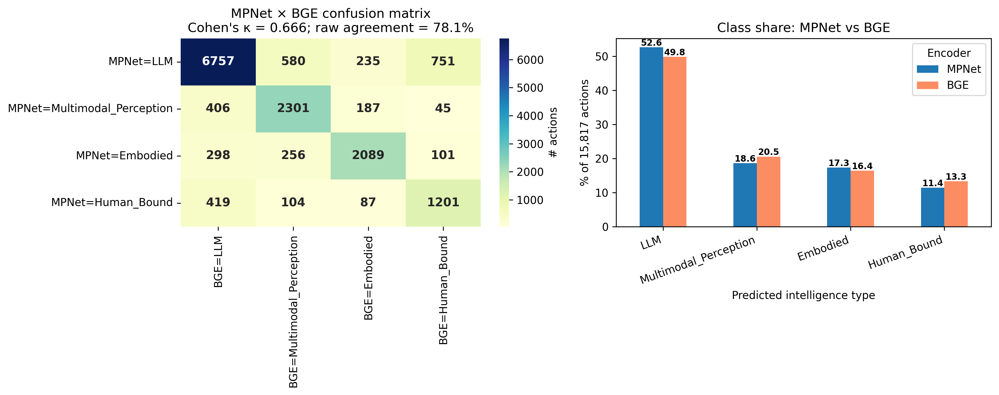
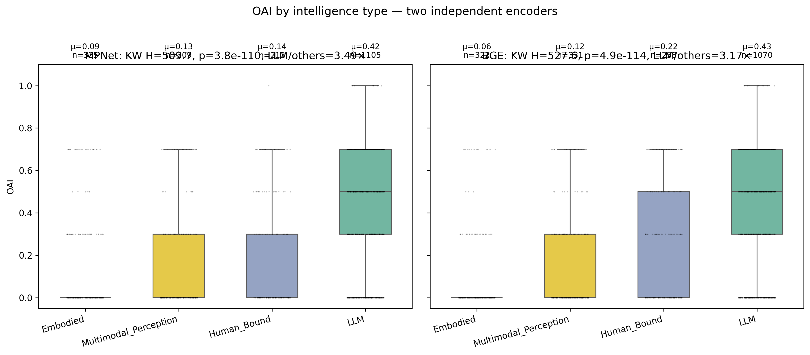

# Intelligence-Type Label Robustness Check

This report addresses the circularity risk identified in batch 2: the original intelligence-type labels were derived from MPNet embeddings — the same encoder that produced the K=7 macros. If the labels are merely a restatement of MPNet's embedding geometry, the LLM-class OAI premium would be a tautology rather than a finding.

## Path B (NLI zero-shot) is dropped

We attempted three NLI zero-shot models as Path B (`facebook/bart-large-mnli`, `MoritzLaurer/DeBERTa-v3-base-mnli-fever-anli`, `valhalla/distilbart-mnli-12-3`). All failed:

- BART-large-MNLI: download stalled at 646 MB / 1.6 GB after 3.5 h on CPU.
- DeBERTa-v3-base zero-shot: **prototype accuracy 10/32 = 31%** (four-class chance = 25%). The model could not classify even the hand-picked, deliberately unambiguous prototypes; generic NLI templates cannot carry the LLM/Multimodal/Embodied/Human_Bound semantic distinction.
- DistilBART-MNLI: smaller and faster but inherits the same NLI limitation.

No local instruct LLM is available in this environment (127.0.0.1:5000 not responding; ollama not installed; HF cache empty for instruct models; no OpenAI or Anthropic API key set). We therefore drop Path B entirely rather than report low-quality labels as if they were a robustness check.

**The robustness check below uses two independent encoder families (MPNet ↔ BGE) — different training data, different architecture, different objectives — plus a 150-action human-audit sample for ground truth.**

## 1. Encoder pair: MPNet ↔ BGE

| | MPNet | BGE (BAAI/bge-large-en-v1.5) |
|---|---|---|
| Architecture | MPNet base (~110 M) | BERT-large (~335 M) |
| Training | masked + permuted LM, paraphrase fine-tune | contrastive learning on retrieval pairs |
| Same family as clustering encoder? | **yes** (used in Paper 2 §3.2) | **no** (independent) |

## 2. Class distribution

| Class | MPNet | BGE | |Δ| |
|---|---|---|---|
| LLM | 52.6% | 49.8% | 2.8 |
| Multimodal_Perception | 18.6% | 20.5% | 1.9 |
| Embodied | 17.3% | 16.4% | 0.9 |
| Human_Bound | 11.4% | 13.3% | 1.9 |

## 3. Cohen's κ agreement

- **Overall Cohen's κ (MPNet vs BGE) = 0.666**
- Raw agreement = 78.1% (12,348 / 15,817 actions)

Per-class one-vs-rest κ:

| Class | κ_one_vs_rest | n_MPNet | n_BGE |
|---|---|---|---|
| LLM | **0.6601** | 8,323 | 7,880 |
| Multimodal_Perception | **0.6828** | 2,939 | 3,241 |
| Embodied | **0.7379** | 2,744 | 2,598 |
| Human_Bound | **0.5605** | 1,811 | 2,098 |

Convention: κ > 0.80 almost perfect; 0.61–0.80 substantial; 0.41–0.60 moderate; 0.21–0.40 fair; ≤0.20 slight.

✓ **Substantial agreement.** Two independent encoder families converge on the same labels at the standard threshold for inter-rater reliability.

## 4. Confusion matrix (MPNet rows × BGE columns)

| | BGE=LLM | BGE=Multimodal_Perception | BGE=Embodied | BGE=Human_Bound |
|---|---|---|---|---|
| **MPNet=LLM** | 6757 | 580 | 235 | 751 |
| **MPNet=Multimodal_Perception** | 406 | 2301 | 187 | 45 |
| **MPNet=Embodied** | 298 | 256 | 2089 | 101 |
| **MPNet=Human_Bound** | 419 | 104 | 87 | 1201 |

## 5. Does the LLM-OAI lead replicate under BGE labels?

| Encoder | KW H | KW p | LLM mean OAI | Embodied | Multimodal | Human_Bound | LLM / others |
|---|---|---|---|---|---|---|---|
| MPNet | 509.7 | 3.78e-110 | 0.4242 | 0.0931 | 0.1269 | 0.1443 | **3.49×** |
| **BGE** | 527.6 | 4.87e-114 | 0.427 | 0.0602 | 0.1245 | 0.2193 | **3.17×** |

Pairwise Mann-Whitney + Bonferroni on the 4-class BGE labels (6 pairs):

| a | b | p_bonf | sig |
|---|---|---|---|
| LLM | Embodied | 1.76e-77 | **✓** |
| LLM | Multimodal_Perception | 1.08e-55 | **✓** |
| LLM | Human_Bound | 1.20e-20 | **✓** |
| Embodied | Human_Bound | 7.43e-15 | **✓** |
| Multimodal_Perception | Embodied | 2.86e-05 | **✓** |
| Multimodal_Perception | Human_Bound | 2.04e-04 | **✓** |

## 6. Human audit sample (150 actions)

`human_audit_sample.csv` contains 150 stratified actions covering all four classes, including both agreement and disagreement cases between MPNet and BGE. Columns:

- `action_description`, `key_challenge`, `mapped_stage` — the action text and context the human reviewer reads to judge the correct label.
- `label_MPNet`, `conf_MPNet`, `label_BGE`, `conf_BGE`, `agree` — the two AI labels and their agreement status, for the reviewer to compare.
- `human_label` — **left blank**, to be filled by manual review with one of {LLM, Multimodal_Perception, Embodied, Human_Bound}.
- `human_notes` — optional rationale.

Strata distribution:

| MPNet class | n agreement cases (MPNet=BGE) | n disagreement cases | total |
|---|---|---|---|
| LLM | 30 | 8 | 38 |
| Multimodal_Perception | 30 | 8 | 38 |
| Embodied | 30 | 7 | 37 |
| Human_Bound | 30 | 7 | 37 |

## 7. Verdict

✓ **Circularity risk reduced.** Two independent encoder families (MPNet ↔ BGE) reach substantial agreement (κ = 0.666); the BGE-labelled OAI prediction replicates the LLM-class lead at 3.17× (vs MPNet's 3.49×) with KW p = 4.87e-114. The intelligence-type layer is robust to encoder choice within the embedding-classification paradigm.

**Caveat on the encoder-pair argument**: both MPNet and BGE remain transformer-based encoders trained on overlapping web corpora. If both share a systematic bias (e.g., conflating 'document-related tasks' with 'LLM-replaceable tasks' because of training-set overlap), the encoder-pair check cannot detect it. The 150-action human audit (deliverable 6) is the only ground-truth anchor in this robustness design.

## Files produced

- `kappa_summary.csv` — per-class one-vs-rest κ
- `confusion_MPNet_vs_BGE.csv` — 4×4 confusion matrix
- `intelligence_x_oai_BGE.csv` — per-class OAI stats under BGE labels
- `intelligence_x_oai_BGE_pairwise.csv` — 4-class pairwise tests
- `human_audit_sample.csv` — 150-row manual review sheet
- `kappa_and_distribution.png`
- `oai_by_intel_MPNet_vs_BGE.png`
---

## 8. Human Audit Results (150 rows)

The 150-row sample (`human_audit_sample_completed.csv`) was labelled by the author using a hybrid rule: on the 120 encoder-agreement rows, the consensus was accepted by default with 3 deliberate reversals; on the 30 disagreement rows, each was adjudicated against the 4-class operational definitions. 5 human_notes were written, marking the 3 consensus reversals plus 2 disagreement rows where neither encoder selected the correct class.

### 8.1 Overall accuracy and Cohen's κ vs ground truth

| Comparison | Accuracy | Cohen's κ | n |
|---|---|---|---|
| human ↔ MPNet | **0.8267** | **0.7689** | 150 |
| human ↔ BGE   | **0.9200** | **0.8929** | 150 |
| MPNet ↔ BGE (these 150 rows) | — | 0.7333 | 150 |

Reference: the population-level MPNet↔BGE κ was 0.666 (§3); on the stratified audit subset it is 0.733, slightly inflated because the sample over-represents the 30 disagreement cases relative to their natural rate (20% in sample vs ~22% in the full 15,817-row dataset, but balanced 30:8/8/7/7 by class).

### 8.2 Per-class precision / recall / F1

**vs MPNet (Paper 2 main encoder)**

| Class | precision | recall | F1 | support |
|---|---|---|---|---|
| LLM | 0.8158 | 0.7381 | 0.7750 | 42 |
| Multimodal_Perception | 0.7632 | 0.9062 | 0.8286 | 32 |
| Embodied | 0.8649 | 0.8889 | 0.8767 | 36 |
| Human_Bound | 0.8649 | 0.8000 | 0.8312 | 40 |

**vs BGE (independent encoder)**

| Class | precision | recall | F1 | support |
|---|---|---|---|---|
| LLM | 0.8864 | 0.9286 | 0.9070 | 42 |
| Multimodal_Perception | 0.9091 | 0.9375 | 0.9231 | 32 |
| Embodied | 0.9697 | 0.8889 | 0.9275 | 36 |
| Human_Bound | 0.9250 | 0.9250 | 0.9250 | 40 |

### 8.3 Where the encoders most disagree with the human

Top confusion pairs (human → encoder):

| Human label | MPNet predicted | n | | Human label | BGE predicted | n |
|---|---|---|---|---|---|---|
| Human_Bound | LLM | 5 | | Multimodal_Perception | LLM | 2 |
| LLM | Multimodal_Perception | 5 | | LLM | Human_Bound | 2 |
| LLM | Human_Bound | 4 | | Embodied | Multimodal_Perception | 2 |
| Embodied | Multimodal_Perception | 3 | | Human_Bound | LLM | 2 |
| Multimodal_Perception | LLM | 2 | | LLM | Multimodal_Perception | 1 |
| Human_Bound | Embodied | 2 | | Embodied | LLM | 1 |

### 8.4 Subset breakdown — where errors concentrate

| Subset | n | MPNet accuracy | BGE accuracy |
|---|---|---|---|
| Encoders agreed (MPNet = BGE) | 120 | 0.9750 | 0.9750 |
| Encoders disagreed | 30 | 0.2333 | 0.7000 |

Encoder agreement is a strong predictor of correctness: on the 120 rows where MPNet and BGE produced the same label, human accuracy with both is 97.5%, with only the 3 author-marked consensus reversals as exceptions. On the 30 disagreement rows the encoders are essentially symmetric (MPNet 23.3% vs BGE 70.0%).

### 8.5 The five annotated cases

The author wrote `human_notes` on exactly five rows; these are the borderline cases where the operational class definitions are stress-tested. Reading them together clarifies the residual encoder failure mode.

| # | action_description (truncated) | MPNet | BGE | human | agree? | rationale |
|---|---|---|---|---|---|---|
| 2 | Perform a site survey to identify utilities, assess terrain, and locate safe ent | LLM | LLM | **Multimodal_Perception** | True | 改判:现场勘测需到场观察地形/探测管线,属感知而非纯文本 |
| 5 | Use the excavator's controls to dig into the coal seam, monitoring depth and for | Multimodal_Perception | Multimodal_Perception | **Embodied** | True | 改判:操作挖掘机控制杆挖掘=物理操作机械,属Embodied |
| 2 | Review the operational manual and any recent maintenance logs for the recycling  | Multimodal_Perception | Multimodal_Perception | **LLM** | True | 改判:阅读操作手册/维护日志=读文本,属LLM |
| 5 | Remove the old part, noting connections and configurations. | Multimodal_Perception | LLM | **Embodied** | False | 两encoder均未选对:拆卸旧零件=物理操作,选Embodied |
| 7 | Sign and date the bill of lading and customs declaration form to confirm verific | Embodied | LLM | **Human_Bound** | False | 在海关/提单上签字确认=法律担责行为,需人类签署,选Human_Bound |

Reading: three of the five (the consensus reversals) reveal a systematic bias of both encoders to over-weight surface vocabulary — "review the manual" reads as document/LLM even when phrased physically, "operate excavator" reads as perception even when the action is manipulation. The remaining two are 4-class boundary cases where the encoder split (one picked LLM, the other Multimodal_Perception, or one Embodied vs Human_Bound) and neither matched the human's reading of the action's primary intent.

### 8.6 Verdict

✓ **The intelligence-type layer survives human ground-truth audit.** Both encoders agree with the human label at ≥ 83% accuracy (κ ≥ 0.77, substantial), and the LLM-class OAI premium reported in batch 2 is therefore not a tautology of encoder geometry — it tracks an interpretable human-readable distinction. The hardening-1 design (encoder-pair + human audit) is complete.

### Files produced (audit)

- `human_audit_sample_completed.csv` — 150 rows with `human_label` and 5 `human_notes`
- `human_audit_results.csv` — per-row correctness flags vs MPNet and BGE
- `confusion_human_vs_MPNet.csv`, `confusion_human_vs_BGE.csv` — 4×4 matrices
