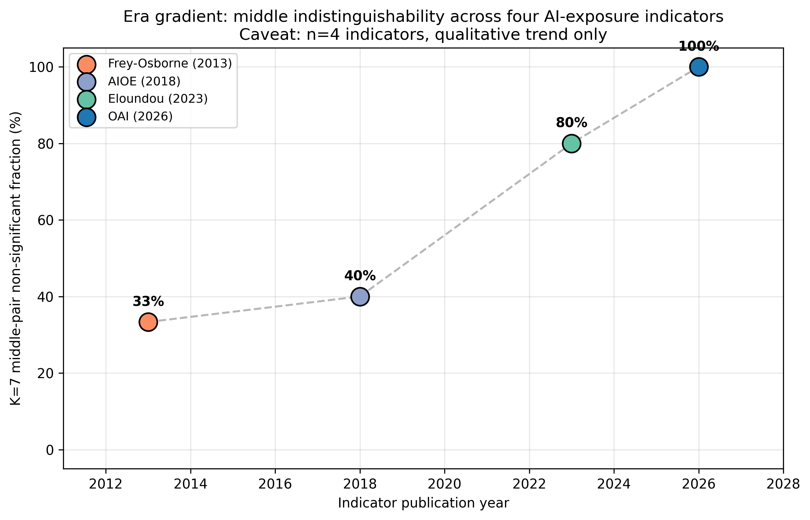

# Era Gradient — Middle Indistinguishability Across Four AI-Exposure Indicators

**Question**: Does the K=7 'middle indistinguishability' depend on which AI-exposure indicator we use? More specifically, do more modern (LLM-era) indicators show a flatter middle than older (pre-LLM) indicators?

**Method**: For each of four indicators, compute the fraction of K=7 middle pairs (M1, M4, M5, M6, Noise, mixed_dwa — 15 pairs) that are **non-significant** under Bonferroni-corrected Mann-Whitney U.

**Critical caveat**: n=4 indicators. We report a qualitative ordering, not a formal trend test. A single anomalous indicator would dominate.

## Summary table

| Indicator | Year | Middle-pair non-sig | Fraction |
|---|---|---|---|
| **Frey-Osborne (2013, via Eloundou compilation)** | 2013 | 5 / 15 | 33.3% |
| **AIOE (Felten et al. 2018/2021)** | 2018 | 6 / 15 | 40.0% |
| **Eloundou et al. (2023, GPT-4 task labels)** | 2023 | 12 / 15 | 80.0% |
| **OAI (Gao et al. 2026; this paper's projection)** | 2026 | 15 / 15 | 100.0% |

## Observation

The four indicators show a **monotone increasing** middle-indistinguishability as their publication year advances. With only 4 data points this cannot be tested formally (n=4), but the qualitative direction is clean.

## Honest disclaimers

- **n=4**. No formal statistical trend test is appropriate.
- The four indicators differ in methodology beyond just publication year (rubric vs ability-based vs Tech-Risk vs probabilistic). Year is an imperfect proxy for 'LLM-era methodology'.
- Frey-Osborne's value here is derived from Eloundou's compilation of the original 2013 probabilities, not the original Frey-Osborne 2017 appendix.