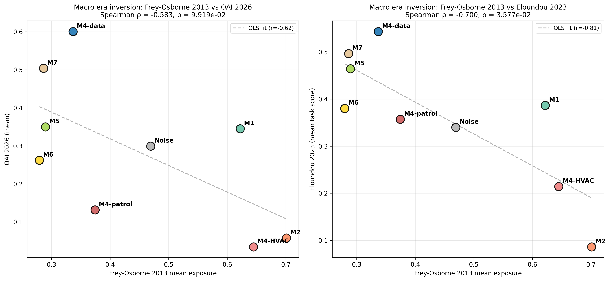

# Era Inversion — Frey-Osborne 2013 vs LLM-Era Indicators

**Question**: Which macros (K=7, with M4 expanded into K=12 sub-macros) show the largest exposure inversion between the pre-LLM era (Frey-Osborne 2013) and the LLM era (OAI 2026, Eloundou 2023)?

**Method**: For each macro, compute mean exposure under each indicator. Rank macros by each. Plot scatter and Spearman correlation across macros.

## Per-macro exposure means and ranks

| Macro | n_DWAs | mean_FO | mean_OAI | mean_Eloundou | rank_FO | rank_OAI | inv_FO_OAI |
|---|---|---|---|---|---|---|---|
| **M4-HVAC** | 84 | 0.6449 | 0.0345 | 0.2141 | 8 | 1 | 7 |
| **M2** | 168 | 0.7011 | 0.0577 | 0.0861 | 9 | 2 | 7 |
| **M4-patrol** | 85 | 0.3743 | 0.1318 | 0.3571 | 5 | 3 | 2 |
| **M6** | 402 | 0.2793 | 0.2622 | 0.3801 | 1 | 4 | 3 |
| **Noise** | 766 | 0.4693 | 0.2995 | 0.3401 | 6 | 5 | 1 |
| **M1** | 140 | 0.622 | 0.345 | 0.3865 | 7 | 6 | 1 |
| **M5** | 68 | 0.2895 | 0.35 | 0.4643 | 3 | 7 | 4 |
| **M7** | 103 | 0.2862 | 0.5039 | 0.4966 | 2 | 8 | 6 |
| **M4-data** | 145 | 0.3367 | 0.6007 | 0.5434 | 4 | 9 | 5 |

## Macro-level Spearman (across macros)

- **FO ↔ OAI**: ρ = -0.583, p = 9.919e-02
- **FO ↔ Eloundou**: ρ = -0.700, p = 3.577e-02

Negative ρ at the macro level means macros which Frey-Osborne 2013 ranked as high-exposure (and v.v.) are ranked oppositely by the LLM-era indicators. This is the per-macro counterpart of the DWA-level inversions reported in the external alignment analysis (AIOE↔FO ρ=−0.567 at DWA level).

## Top three rank-inversions (FO vs OAI)

- **M2**: FO rank = 9, OAI rank = 2, inversion = 7 ranks.
- **M4-HVAC**: FO rank = 8, OAI rank = 1, inversion = 7 ranks.
- **M7**: FO rank = 2, OAI rank = 8, inversion = 6 ranks.

## Interpretation hooks (for paper Discussion)

- A macro in the **upper-left** (low FO, high LLM-era) is one that 2013-era automation theory considered safe but LLM-era automation now flags.
- A macro in the **lower-right** (high FO, low LLM-era) is the classical computerization target (routine manual / clerical) that LLMs do not touch.
- Points clustered along the diagonal (no inversion) are macros both eras agree on (likely the most extreme physical or most extreme cognitive).