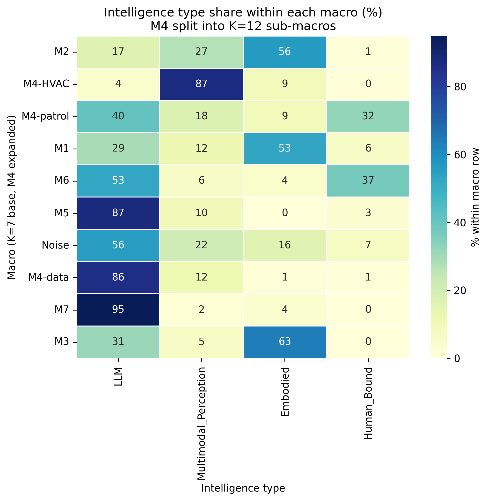

# Intelligence Type × Macro Cross-Tabulation

Each micro-action was labeled with one of four intelligence-type categories via prototype-embedding few-shot classification (8 hand-picked prototypes per class, MPNet embedding, cosine-similarity nearest-centroid, softmax confidence τ=0.05). M4 is decomposed into its K=12 sub-macros: M4-HVAC (C33,C34), M4-patrol (C2,C12,C19), M4-data (C16,C17,C20,C25).

## Overall distribution (15,817 actions)

| Class | n | % |
|---|---|---|
| LLM | 8,323 | 52.6% |
| Multimodal_Perception | 2,939 | 18.6% |
| Embodied | 2,744 | 17.3% |
| Human_Bound | 1,811 | 11.4% |

Median classifier confidence: 0.863; mean: 0.807.

## Cross-tab — share of each intelligence type within each macro (%)

| Macro | LLM | Multimodal_Perception | Embodied | Human_Bound |
|---|---|---|---|---|
| **M2** | 17% | 27% | 56% | 1% |
| **M4-HVAC** | 4% | 87% | 9% | 0% |
| **M4-patrol** | 40% | 18% | 9% | 32% |
| **M1** | 29% | 12% | 53% | 6% |
| **M6** | 53% | 6% | 4% | 37% |
| **M5** | 87% | 10% | 0% | 3% |
| **Noise** | 56% | 22% | 16% | 7% |
| **M4-data** | 86% | 12% | 1% | 1% |
| **M7** | 95% | 2% | 4% | 0% |
| **M3** | 31% | 5% | 63% | 0% |

## Hypothesis check vs prior

| Macro | Predicted concentration | Observed | Verdict |
|---|---|---|---|
| M7 | LLM | 95% | ✓ |
| M2 | Embodied | 56% | ✓ |
| M4-data | LLM | 86% | ✓ |
| M4-HVAC | Embodied | 9% | ✗ |
| M4-patrol | Multimodal_Perception | 18% | partial |
| M6 | Human_Bound | 37% | ✓ |
