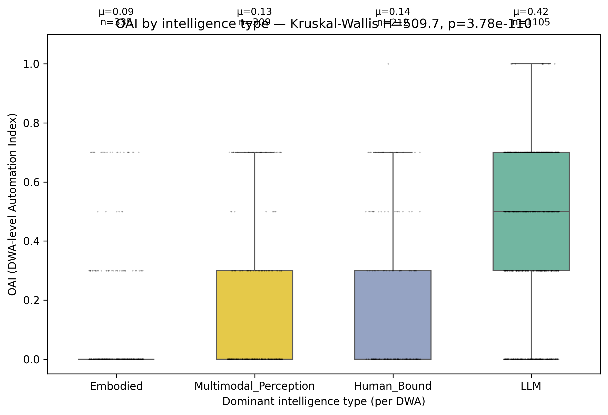

# Does Intelligence Type Independently Predict OAI?

If intelligence-type labels are an honest interpretive layer (not post-hoc storytelling), they should predict OAI without re-using the macro structure. Test: assign each DWA the dominant intelligence type of its actions; compare OAI distributions across the four types.

## Per-class OAI distribution (DWA level)

| Intelligence | n_DWAs | mean OAI | median | std |
|---|---|---|---|---|
| **Embodied** | 335 | 0.0931 | 0.0 | 0.2031 |
| **Human_Bound** | 212 | 0.1443 | 0.0 | 0.2425 |
| **Multimodal_Perception** | 309 | 0.1269 | 0.0 | 0.2298 |
| **LLM** | 1105 | 0.4242 | 0.5 | 0.2822 |

**Kruskal-Wallis**: H = 509.70, df = 3, p = 3.776e-110

**Pairwise Mann-Whitney + Bonferroni** (6 pairs):

| a | b | p_bonf | sig |
|---|---|---|---|
| Embodied | LLM | 1.83e-66 | **✓** |
| Multimodal_Perception | LLM | 8.72e-51 | **✓** |
| Human_Bound | LLM | 4.13e-34 | **✓** |
| Embodied | Human_Bound | 5.19e-02 | ✗ |
| Embodied | Multimodal_Perception | 2.30e-01 | ✗ |
| Human_Bound | Multimodal_Perception | 1.00e+00 | ✗ |

## Verdict

✓ **Intelligence type independently predicts OAI.** The four-class labels are not just post-hoc storytelling — they separate the OAI distribution at gold-standard significance with multiple pairwise differences surviving Bonferroni correction.

**Circularity caveat**: the intelligence labels were inferred from the same MPNet embedding space that produced the K=7 macros. A strong independent test would re-label using a different encoder or human raters; we have not done that in this batch.