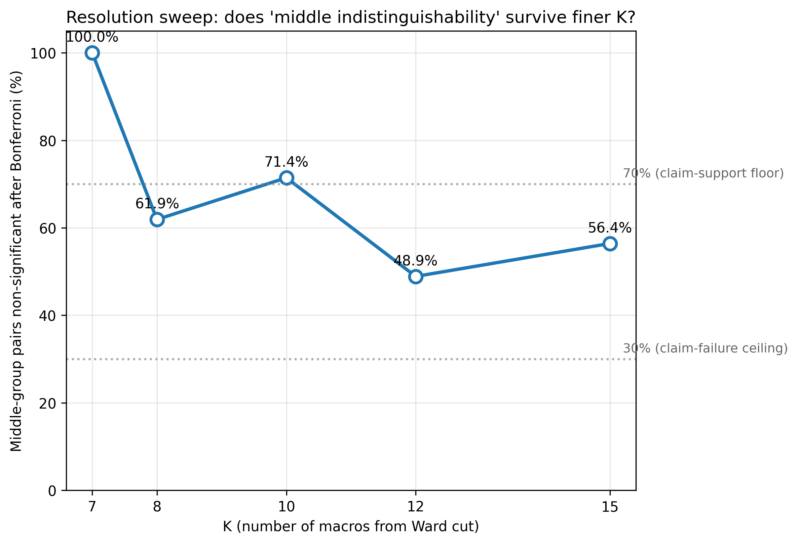

# Resolution Sweep — K = 7, 8, 10, 12, 15

Tests whether the K=7 'middle six non-distinguishable' finding survives finer Ward cuts, or is an artifact of coarse resolution.

## Summary table

| K | n_groups | low pole (mean OAI) | high pole (mean OAI) | H | p_KW | Middle pairs non-sig (Bonferroni) | M2 micros in low pole | M7 micros in high pole |
|---|---|---|---|---|---|---|---|---|
| **7** | 8 | M2 (0.055) | M7 (0.502) | 164.59 | 3.47e-32 | **15 / 15 = 100.0%** | 5 / 5 (100%) | 5 / 5 (100%) |
| **8** | 9 | M2 (0.055) | M8 (0.502) | 214.27 | 6.24e-42 | **13 / 21 = 61.9%** | 5 / 5 (100%) | 5 / 5 (100%) |
| **10** | 10 | M3 (0.038) | M10 (0.502) | 220.16 | 1.93e-42 | **20 / 28 = 71.4%** | 4 / 5 (80%) | 5 / 5 (100%) |
| **12** | 12 | M7 (0.031) | M8 (0.604) | 406.84 | 2.16e-80 | **22 / 45 = 48.9%** | 0 / 5 (0%) | 0 / 5 (0%) |
| **15** | 15 | M8 (0.031) | M9 (0.604) | 497.17 | 3.69e-97 | **44 / 78 = 56.4%** | 0 / 5 (0%) | 0 / 5 (0%) |

## Pole stability (which K=7 pole micros land in each K's pole macro)

**K=7 reference**: M2 micros = C6, C7, C8, C24, C26; M7 micros = C0, C11, C13, C27, C32

- **K=7**: low pole `M2` contains M2-micros [6, 7, 8, 24, 26]; high pole `M7` contains M7-micros [0, 11, 13, 27, 32]
- **K=8**: low pole `M2` contains M2-micros [6, 7, 8, 24, 26]; high pole `M8` contains M7-micros [0, 11, 13, 27, 32]
- **K=10**: low pole `M3` contains M2-micros [6, 8, 24, 26]; high pole `M10` contains M7-micros [0, 11, 13, 27, 32]
- **K=12**: low pole `M7` contains M2-micros []; high pole `M8` contains M7-micros []
- **K=15**: low pole `M8` contains M2-micros []; high pole `M9` contains M7-micros []

## Decision (per locked criteria in PLAN.md)

- Middle non-sig fraction at K=12: **48.9%**
- Middle non-sig fraction at K=15: **56.4%**

⚠ **Gray zone**: middle structure is partly resolution-dependent. Honest reporting required in the paper.

